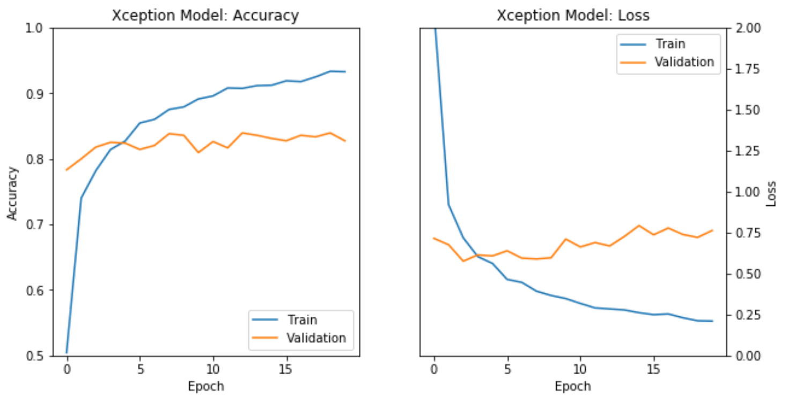

# DogBreedClassifier

## Project Brief

This project forms the basis of learning about Convolutional Neural Networks and Transfer Learning. The aim is to use `transfer learning` to create a dog breed classification model capble of taking an image as input and predicting what dog breed the image resembles. 

The model is trained and evaluated in `dog_app.ipynb` and can be used in web-app form by following the instructions below. 

## Summary of findings

Using the technique of transfer learning, whereby a model trained for solving one problem is applied to a different but related problem, I have taken the [Xception](https://keras.io/api/applications/xception/) CNN model pre-trained on [ImageNet](https://www.image-net.org/download.php) and retrained the final layers with 6680 images of various dogs to classify dog breeds from user provided images. 

The final model achieves a test accuracy of ~$82\,\%$ and the training and validation accuracy and loss can be seen in Figure 1 below.

<figure>

<figcaption align = "left"><b>Fig.1</b> - Xception model train and validation accuracy and loss. </figcaption>
</figure>

<br>In the corresponding web-app, a user can upload an image file and check what dog breed the model predicts as seen in Figure 2.

<figure>

<figcaption align = "left"><b>Fig.2</b> - Webapp example of model correctly predicting the breed as Pomenarian. </figcaption>
</figure>
<br>

## Using the model
### Environment Setup Instructions:

I've used [Anaconda](https://www.anaconda.com/) with Python 3.9.13 to create the environment for this work. You can use the `environment_dogApp.yml` file to create the environment locally using:

```
conda env create -f environment_dogApp.yml
```

You can then activate it with

```
conda activate tf-gpu
```
This will install various Python packages including `tensoflow-gpu`, `keras`, `sklearn`, `flask` and their dependencies. 

:information_source: you might need to use the conda-forge when creating this environment :information_source:

### App run Instructions:

1. Run the following command in the project's root directory to run your web app.
    `python app/run.py`

2. Go to http://0.0.0.0:3001/

3. Choose a `jpg/jpeg` image file to classify and click `Upload image` once you've selected the file you want

4. Wait for the app to return the model's prediction and see if you agree with its findings.

:information_source: The app can take a bit of time to get going the first time around. Caching may improve this. :information_source: 


### Notebook run Instructions:

1. You can run the cells in the `dog_app.ipynb` notebook in the standard Jupyter Notebook way.

:warning: This notebook carries out convolution neural network training and requires a good graphics card with lots of memory. I've also not included the training images to this git repository due to storage constraints. If you want to get this data, please drop me a message. :warning: 


## File descriptions
Below we have a brief description of the directories and the files they contain. 
- `app` <br>
  &nbsp;| - `template` <br>
  &nbsp;| --- `index.html`: main page of web app <br>
  &nbsp;| - `detector_models.py`: Detector model classes <br>
  &nbsp;| - `dog_classifier.py`: Dog breed classifier class <br>
  &nbsp;| - `helpers.py`: Helper functions <br>
  &nbsp;| - `run.py`: Flask file that runs app <br>
- `bin` <br>
  &nbsp;| - `run-black.sh`: script to run black linting <br>
  &nbsp;| - `run-black.sh`: script to run flake8 linting <br>
  &nbsp;| - `run-black.sh`: script to run mypy linting <br>
- `bottleneck_features` <br>
  &nbsp;| &nbsp;&nbsp; Directory to store bottleneck features for the `dog_app` notebook (empty in git) <br>
- `data` <br>
  &nbsp;| - `dog_names.json`: json file containing names of dog breeds that can be classified <br>
- `haarcascades` <br>
  &nbsp;| - `haarcascades_frontalface_alt.xml`: model weights for human face recognition model <br>
- `images` <br>
  &nbsp;| &nbsp;&nbsp; 13 `jpg/png` image files used in the `dog_app` notebook and README <br>
- `requirements` <br>
  &nbsp;| - `dog-linux-gpu.yml`: GPU `dog_app` notebook anaconda python environment export <br>
  &nbsp;| - `dog-linux.yml`: CPU `dog_app` notebook anaconda python environment export <br>
  &nbsp;| - `requirements-gpu.txt`: GPU `dog_app` notebook pip python environment export <br>
  &nbsp;| - `requirements.txt`: CPU `dog_app` notebook pip python environment export <br>  
- `saved_models` <br>
  &nbsp;| - `dogBreedXception.h5`: re-trained imagenet model for dog breed classification <br>
- `test_images` <br>
  &nbsp;| &nbsp;&nbsp; 7 `jpg/jpeg` image files used to testing final CNN model <br>
- `README.md`: readme file
- `.gitattributes`: contains files managed by git-lfs
- `.gitignore`: file/folders to ignore
- `environment_dogApp.yml`: flask app GPU anaconda python environment export
- `setup.cfg`: setup configs for flake8
- `dog_app.ipynb`: notebook used for exploration, dog breed classification model creation and training.


---

<a rel="license" href="http://creativecommons.org/licenses/by-nc-sa/4.0/"></a><br />This work is licensed under a <a rel="license" href="http://creativecommons.org/licenses/by-nc-sa/4.0/">Creative Commons Attribution-NonCommercial-ShareAlike 4.0 International License</a>.